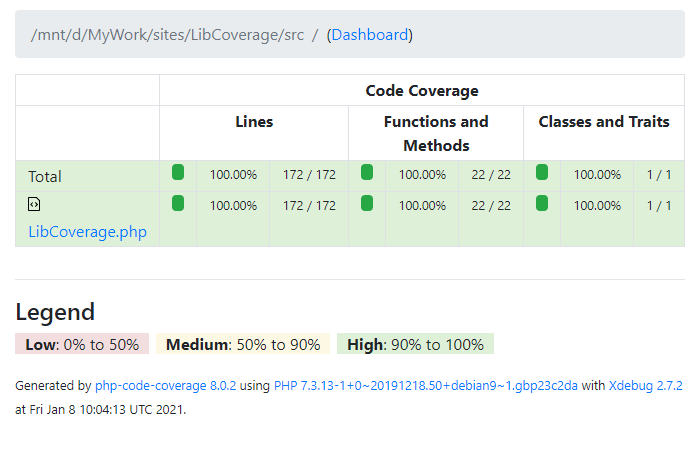

# LibCoverage
*** v1.0.1 版 ***
作者QQ: 85811616

官方QQ群: 714610448

LibCoverage 用于帮助 PHP 库的开发者完成全覆盖测试。让你的php 代码更健壮。

## 使用方法

```
composer require --dev dvaknheo/libcoverage ## 安装
composer exec libcoverage          # 查看帮助
composer exec libcoverage setup    # 安装
phpunit                            # phpunit 单元测试
cat test_reports/index.html        # 查看报告，你可以用浏览器打开
# composer exec libcoverage cloze  # 新增了类，添加测试模板
# phpunit tests/AppTest.php && phpunit tests/support.php # 某类的猜测类变更，重新生成
# composer exec libcoverage report  # 备用生成报告， phpunit 的时候已经就有了。
```

`composer exec libcoverage setup ` 生成 `phpunit.xml`(如不存在) 和相应支持文件 `tests/boostrap.php` 和 `tests/support.php` 文件

运行 `phpunit` ，然后查看 test_reports 目录下的 `index.html`

`setup` 还根据相应的 src 目录的类文件生成对应的 `tests/*Test.php` 测试模板文件

例如 src/App.php

```php
<?php
namespace MyProject;

class App
{
    public function foo()
    {
        var_dump(DATE(DATE_ATOM));
    }
}
```
会生成 AppTest.php
```php
<?php 
namespace tests\MyProject;

use MyProject\App;

use LibCoverage\LibCoverage;

class AppTest extends \PHPUnit\Framework\TestCase
{
    public function testAll()
    {
        LibCoverage::Begin(App::class);
        
        /* //
        App::G()->foo();
        //*/
        
        LibCoverage::End();
    }
}

```
中间测试代码由你来完成哦，绞尽脑汁为当前类写 100% 覆盖的测试代码吧。

`composer exec libcoverage cloze` 用来填补你后来添加的测试文件。 测试文件不会被覆盖。

`phpunit tests/AppTest.php && phpunit tests/support.php` 则是一个技巧，用于只修改了单个文件的情况

这是 LibCoverage 运行 phpunit 自举全覆盖测试的截图。 test_reports/index.html 的示例




### LibCoverage 类选项
```
    public $options = [
        'namespace' => null,
        'path' => null,
        'path_src' => 'src',
        'path_dump' => 'test_coveragedumps',
        'path_report' => 'test_reports',
        'path_test' => 'tests',
        'path_data' => 'tests/data_for_tests',
        'auto_detect_namespace' => true, 
    ];
```

`composer exec libcoverage` 的时候可以把这些选项带进来。如

`composer exec libcoverage --path='abc'  --path_test=test` 等

## LibCoverage 类公开方法参考

静态方法，常用需求都是调用静态方法.
```
    LibCoverage::G($object=null); // 可变单例函数
    LibCoverage::Begin($class);    // 开始一个类的全覆盖跟踪
    LibCoverage::End();  // 结束一个类的跟踪
```

额外的方法
```
    LibCoverage::G()->init(array $options, ?object $context = null); // boostrap.php 用来初始化的.
    LibCoverage::G()->showAllReport();  // support.php 用来显示所有报告的
    LibCoverage::G()->createProject();  // 创建工程文件, setup
    LibCoverage::G()->createTests();  // 创建测试文件, cloze
```
其他不常用公开方法
```
    LibCoverage::G()->isInited();  // 扩展
    LibCoverage::G()->addExtFile($extFile); // 添加额外测试文件，如全局函数文件等
    LibCoverage::G()->getClassTestPath($class); // 获得测试类专用目录， 默认是 tests/data_for_test/【类名】
    LibCoverage::G()->cleanDirectory($dir);  // 辅助方法，用于情况测试目录等。
```
## 全覆盖测试通过不等于所有功能测试通过

代码中可能用 @codeCoverageIgnore ,@codecoverageIgnoreStart , @codecoverageIgnoreEnd 这三个指令跳过。

还有，条件短路会跳过后面的。

还有，被迫全覆盖测试的人为了全覆盖测试，不一定能跑完所有逻辑。

## 其他

