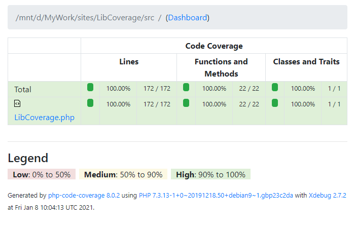

# LibCoverage

[English](README.md) | [中文](README-zh-CN.md)

*** v1.0.8 ***
LibCoverage for full code coverage for php library creater.


## usage

```
composer require --dev dvaknheo/libcoverage
composer exec libcoverage          # show help
composer exec libcoverage setup
phpunit
cat test_reports/index.html        #  you can use browser open it
# composer exec libcoverage cloze  # write a new class , cloze it.
# phpunit tests/AppTest.php && phpunit tests/support.php # report for a class change
# composer exec libcoverage report  # 
```

`composer exec libcoverage setup ` create  `phpunit.xml` and `tests/boostrap.php` and `tests/support.php` on not exists

run `phpunit` , browse `test_reports/index.html`

`setup` command folow `src` create `tests/*Test.php` test template.

e.g. src/App.php

```php
<?php
namespace MyProject;

class App
{
    public function foo()
    {
        var_dump(DATE(DATE_ATOM));
    }
}
```
be  tests/AppTest.php
```php
<?php 
namespace tests\MyProject;

use MyProject\App;

use LibCoverage\LibCoverage;

class AppTest extends \PHPUnit\Framework\TestCase
{
    public function testAll()
    {
        LibCoverage::Begin(App::class);
        
        /* //
        App::_()->foo();
        //*/
        
        LibCoverage::End();
    }
}

```
finish test code, good job.

next image is LibCoverage self unit test report




## LibCoverage options
```
    public $options = [
        'namespace' => null,
        'path' => null,
        'path_src' => 'src',
        'path_dump' => 'test_coveragedumps',
        'path_report' => 'test_reports',
        'path_test' => 'tests',
        'path_data' => 'tests/data_for_tests',
        'auto_detect_namespace' => true,
    ];
```

`composer exec libcoverage` can take these options on.

e.g. `vendor/bin/libcoverage --path='abc'  --path_test=test`

## LibCoverage class public methods

static methods
```
    LibCoverage::_($object=null); // changable singleton.
    LibCoverage::Begin($class);    // begin a class trace.
    LibCoverage::End();  // end a class trace.
```

ext methods
```
    LibCoverage::_()->init(array $options, ?object $context = null); // boostrap.php use to init
    LibCoverage::Report();  // support.php use to report
    LibCoverage::NewProject();  //  use by command setup
    LibCoverage::Cloze();  // use by command cloze
```
other methods
```
    LibCoverage::_()->isInited();
    LibCoverage::_()->addExtFile($extFile); // use to global function and more.
    LibCoverage::_()->getClassTestPath($class); // directory for class . e.g. tests/data_for_test/<$class>
    LibCoverage::_()->cleanDirectory($dir);  // for clean support dir.
```
## customer and option 'override_class'

```php
<?php
namespace MyProject;
 
class MyLibCoverage extends \LibCoverage\LibCoverage
{
    public function showAllReport()
    {
        parent::showAllReport();
        echo "\n-------- customer overrrided -------\n";
    }
}
```
